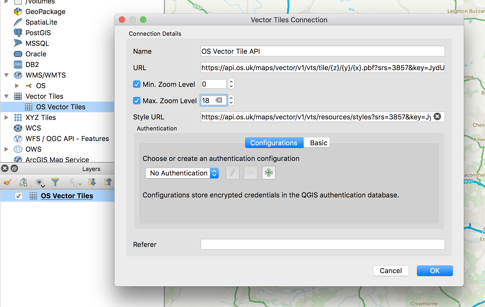

# OS Vector Tiles in QGIS

The [OS Vector Tile API](https://osdatahub.os.uk/docs/vts/overview) is a Vector Tile Service  that gives developers access to map tiles derived from OS Open and Premium datasets. Vector tiles offer a number of benefits over raster map tiles: they're more lightweight, you can customise individual layers / features, and you can create sophisticated interactivity including 3D experiences in the browser and smartphone. 

QGIS is an open source desktop GIS programme used by analysts and cartographers all over the world. The project recently announced that the programme would natively support vector tiles. This is a quick guide to help you connect QGIS to the OS Vector Tile API. 

1. Make sure you have QGIS 3.16 installed - earlier versions do not have native vector tile support for the format provided by the OS Vector Tile API. 
2. Sign up for an account on the [OS Data Hub](https://osdatahub.os.uk/). You can access vector tiles via both Open and Premium accounts - Premium API keys will provide more detailed maps at higher zoom levels. 
3. Create a new Project and add the Vector Tile API - from here you should have an API key. 
4. In the Browser pane, right clieck `Vector Tiles` >> `New Generic Connection`
5. Set fields as follows: 

| | |
| --- | --- |
| Name | `OS Vector Tile API` (or whatever) |
| URL | `https://api.os.uk/maps/vector/v1/vts/tile/{z}/{y}/{x}.pbf?srs=3857&key=<YOUR KEY HERE>` |
| Max. Zoom Level | `18` |
| Style URL | `https://api.os.uk/maps/vector/v1/vts/resources/styles?srs=3857&key=<YOUR KEY HERE>`| 

6. Click `OK` - you should see the layer as an option beneath the `Vector Tiles` label in the Browser list. 
7. Drag the `OS Vector Tile API` layer to your Layers pane, or right click >> `Add Layer to Project`.
8. Viola! Should have the vector tiles rendering, styled based on the OS stylesheets. (Note that there are some issues with fonts and sprites as this is an unstable version of QGIS.)
9. Feedback? Want to share? Tag @ordnancesurvey and #OSDeveloper on Twitter or email john.hoopes(AT)os.uk.